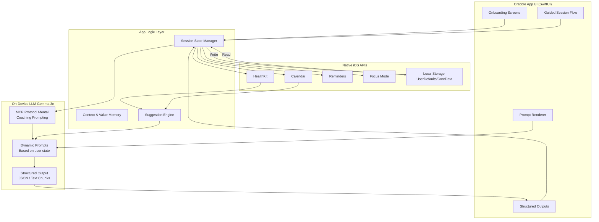

# Crabble

A SwiftUI iOS app featuring an AI-powered task breakdown assistant using Gemma 3n for contextual text generation.

## Features

- **AI-Powered Text Generation**: Uses Gemma 3n model for contextual responses
- **Task Breakdown Assistant**: Helps users break down complex tasks into manageable steps
- **Real-time Streaming**: Progressive text display with typing animations
- **Interactive Suggestions**: Click suggestions to get contextual guidance
- **Modern UI**: Beautiful SwiftUI interface with smooth animations

## Requirements

- iOS 15.0+
- Xcode 14.0+
- CocoaPods

## Installation

### 1. Clone the Repository

```bash
git clone https://github.com/Hodisy/Crabble.git
cd Crabble
```

### 2. Install Dependencies

```bash
pod install
```

### 3. Download Gemma 3n Model

1. Go to [Hugging Face - Gemma 3n E2B IT Litert Preview](https://huggingface.co/google/gemma-3n-E2B-it-litert-preview) (for the MediaPipe version)
2. Download the `gemma-3n-E2B-it-int4.task` file
3. Add the file to your Xcode project's Assets folder

### 4. Open and Build

```bash
open Crabble.xcworkspace
```

Build and run the project in Xcode.

## Usage

### Basic Implementation

```swift
CrabbyThinks(
    bodyText: "Initial text...",
    hasFixedSize: true,
    maxLines: 3,
    suggestions: ["Suggestion 1", "Suggestion 2"],
    context: "User is working on breaking down FAFSA application tasks...",
    promptType: .taskBreakdown
)
```

### Available Prompt Types

- `.taskBreakdown` - Help break down complex tasks
- `.motivation` - Provide encouragement and motivation
- `.productivity` - Offer productivity advice
- `.stressManagement` - Help with stress management
- `.goalSetting` - Assist with goal setting

## Architecture



### Core Components

- **OnDeviceModel**: Manages MediaPipe LLM inference
- **Chat**: Handles streaming responses
- **ConversationViewModel**: Manages conversation state
- **PromptGenerator**: Creates contextual prompts
- **CrabbyThinks**: Main UI component with AI integration

### LLM Integration

The app uses MediaPipe for on-device inference with the Gemma 3n model. Text generation is contextual and adapts to user interactions.

## License

This project is licensed under the Creative Commons Attribution 4.0 International License - see the [LICENSE](LICENSE) file for details.

## Contributing

Please feel free to submit a Pull Request.

## Acknowledgments

- [MediaPipe](https://mediapipe.dev/) for on-device ML inference
- [Gemma 3n](https://ai.google.dev/gemma) by Google for text generation
- [Hugging Face](https://huggingface.co/) for model hosting

## Author

**Yafa** - [GitHub](https://github.com/Hodisy)


